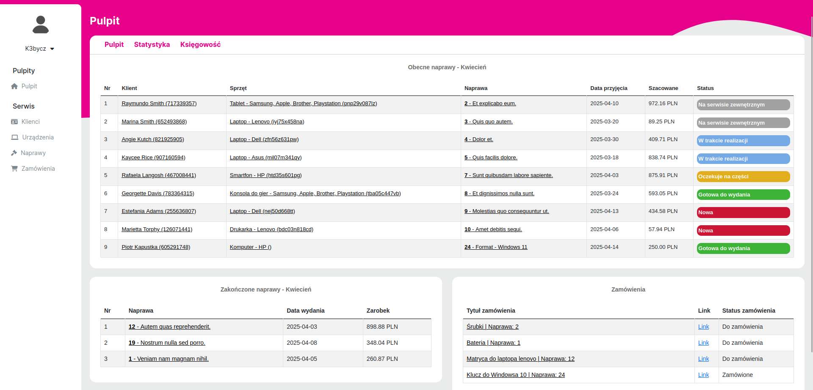
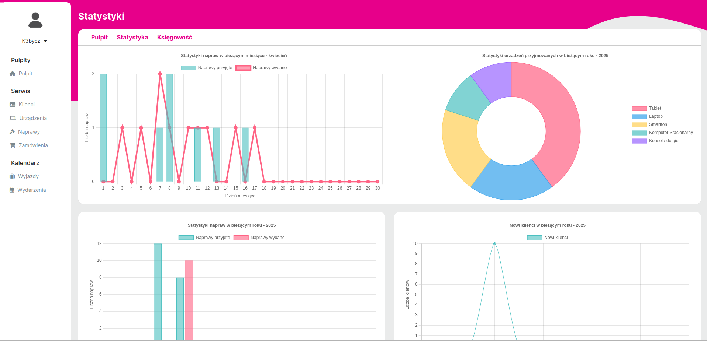

# 💻 Computer Service Management System

A web-based **Computer Service Management System** built with Laravel, PostgreSQL, Docker, and Bootstrap.  
It helps computer repair businesses manage clients, devices, repairs, part orders, and monitor statistics and revenue.

> ⚠️ **Work in progress** — This project is still under active development. New features will be added regularly.

## 🚀 Features

- 👥 **Client Management**  
  Add and manage clients and their contact details.

- 🖥️ **Device & Repair Tracking**  
  Log devices and track their repair progress with full history.

- 🔍 **Filtering & Search**  
  Easily find clients, devices, and repairs using filtering and search.

- 🛒 **Part Orders**  
  Keep notes of ordered parts, their status, and prices.

- 📊 **Dashboard & Statistics**  
  Get insight into:
  - Number of repairs
  - Revenue and profit
  - Completed and pending jobs

## 🧰 Tech Stack

- **Framework:** Laravel
- **Database:** PostgreSQL
- **Frontend:** Bootstrap + JavaScript
- **Dev Environment:** Docker

## 📸 Screenshots

### 📍 Dashboard Overview  


### 🛠️ Statistics View 


## 🧪 Development Status

This system is under continuous development. Planned features include:

- Role-based access and user accounts
- Email/SMS notifications
- Adding PDF generation

## 🛠️ Running the Project (Docker)

```bash
# Clone the repository
git clone https://github.com/K3bycz/ServiceManager.git

# Build and start the containers
docker compose up -d

# Run Laravel setup
docker exec -it container-name bash
composer install
php artisan migrate --seed
